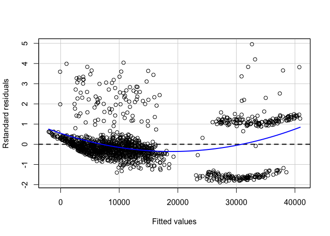
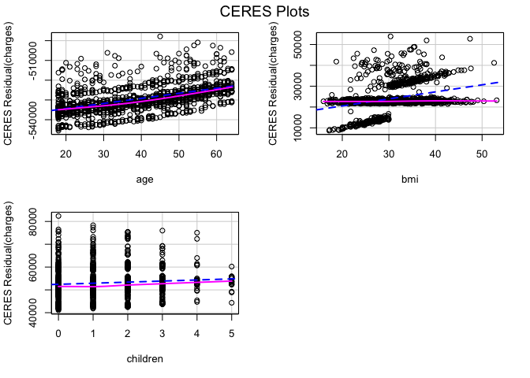
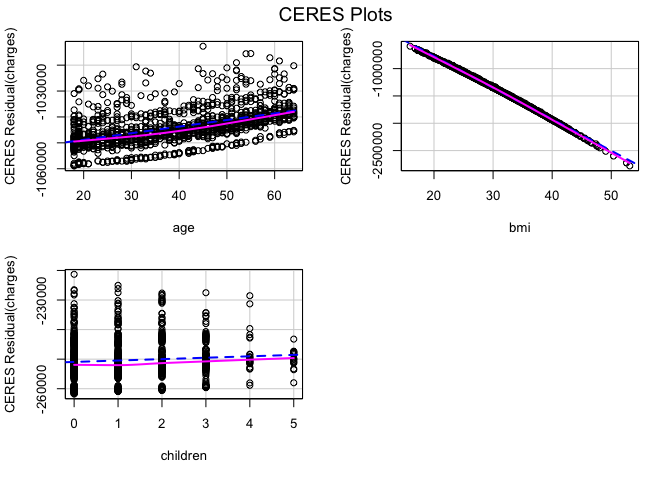
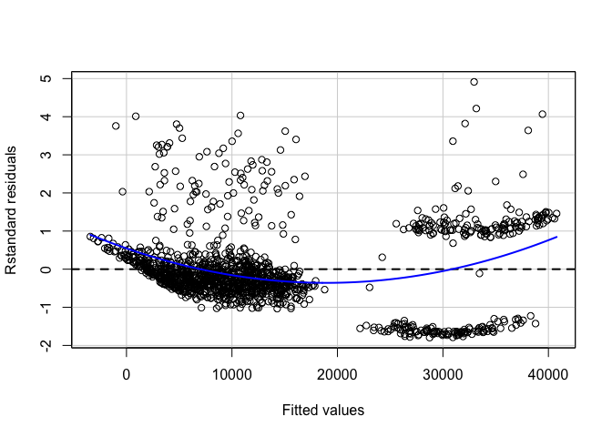
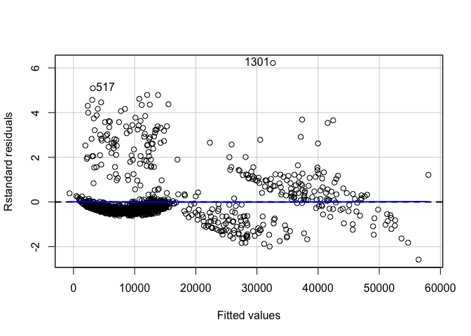
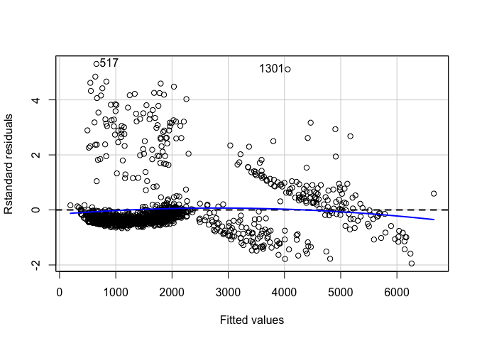
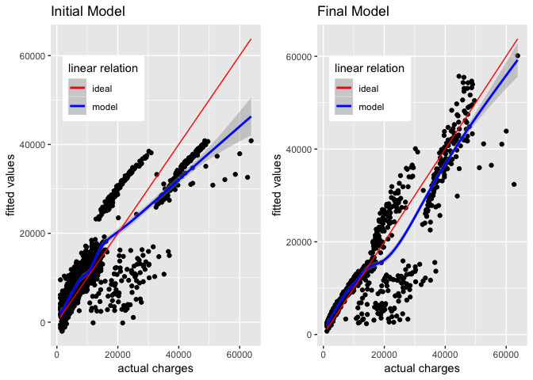
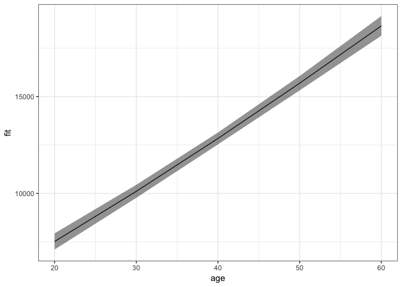
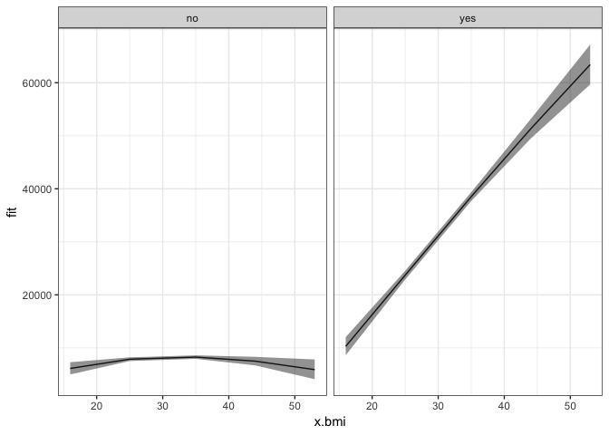

**Introduction**
----------------

Regression analysis is a powerful statistical process to find the relations within a dataset, with the key focus being on relationships between the independent variables (predictors) and a dependent variable (outcome). It can be used to build models for inference or prediction. Among several methods of regression analysis, linear regression sets the basis and is quite widely used for <a href="https://en.wikipedia.org/wiki/Linear_regression#Applications" target="_blank">several real-world applications</a>.

In this post, we will look at building a linear regression model for inference. The dataset we will use is the insurance charges data obtained from <a href="https://www.kaggle.com/mirichoi0218/insurance/home" target="_blank">Kaggle</a>. This data set consists of 1,338 observations and 7 columns: age, sex, bmi, children, smoker, region and charges.

The key questions that we would be asking are:

1.  Is there a relationship between medical charges and other variables in the dataset?
2.  How valid is the model we have built?
3.  What can we do to improve the model?


We start with importing the main required libraries and data:

``` r
library(magrittr)
library(car)
library(broom)
library(ggplot2)
```

``` r
insurance <- read.csv('~/Documents/CodeWork/medicalCost/insurance.csv')
summary(insurance)
```

          age            sex           bmi           children     smoker    
     Min.   :18.00   female:662   Min.   :15.96   Min.   :0.000   no :1064  
     1st Qu.:27.00   male  :676   1st Qu.:26.30   1st Qu.:0.000   yes: 274  
     Median :39.00                Median :30.40   Median :1.000             
     Mean   :39.21                Mean   :30.66   Mean   :1.095             
     3rd Qu.:51.00                3rd Qu.:34.69   3rd Qu.:2.000             
     Max.   :64.00                Max.   :53.13   Max.   :5.000             
           region       charges     
     northeast:324   Min.   : 1122  
     northwest:325   1st Qu.: 4740  
     southeast:364   Median : 9382  
     southwest:325   Mean   :13270  
                     3rd Qu.:16640  
                     Max.   :63770  

Some simple observations that can be made from the summary are:

1.  The age of participants varies from 18 to 64.
2.  Around 49.48% of participants are female.
3.  The bmi of participants ranges from 15.96 to 53.13.
4.  Only 20.48% of the participants are smokers.

Let's start with building a linear model. Instead of simple linear regression, where you have one predictor and one outcome, we will go with multiple linear regression, where you have more than one predictors and one outcome.

Multiple linear regression follows the formula :

*y* = *β*<sub>0</sub> + *β*<sub>1</sub>*x*<sub>1</sub> + *β*<sub>2</sub>*x*<sub>2</sub> + ...

The coefficients in this linear equation denote the magnitude of additive relation between the predictor and the response. In simpler words, keeping everything else fixed, a unit change in *x*<sub>1</sub> will lead to change of *β*<sub>1</sub> in the outcome, and so on.

**Is there a relationship between the medical charges and the predictors?**
---------------------------------------------------------------------------

Our first step is finding if there is any relationship between the outcome and the predictors.

The null hypothesis would be that there is no relation between any of the predictors and the response, which can be tested by computing the <a href="http://www.statisticshowto.com/probability-and-statistics/F%20statistic-value-test/" target="_blank">F statistic</a>. The p-value of F statistic can be used to determine whether the null hypothesis can be rejected or not.

We will start with fitting a multiple linear regression model using all the predictors:

``` r
lm.fit <- lm(formula = charges~., data = insurance)
#Here '.' means we are using all the predictors in the dataset.
summary(lm.fit)
```


    Call:
    lm(formula = charges ~ ., data = insurance)

    Residuals:
         Min       1Q   Median       3Q      Max 
    -11304.9  -2848.1   -982.1   1393.9  29992.8 

    Coefficients:
                    Estimate Std. Error t value Pr(>|t|)    
    (Intercept)     -11938.5      987.8 -12.086  < 2e-16 ***
    age                256.9       11.9  21.587  < 2e-16 ***
    sexmale           -131.3      332.9  -0.394 0.693348    
    bmi                339.2       28.6  11.860  < 2e-16 ***
    children           475.5      137.8   3.451 0.000577 ***
    smokeryes        23848.5      413.1  57.723  < 2e-16 ***
    regionnorthwest   -353.0      476.3  -0.741 0.458769    
    regionsoutheast  -1035.0      478.7  -2.162 0.030782 *  
    regionsouthwest   -960.0      477.9  -2.009 0.044765 *  
    ---
    Signif. codes:  0 '***' 0.001 '**' 0.01 '*' 0.05 '.' 0.1 ' ' 1

    Residual standard error: 6062 on 1329 degrees of freedom
    Multiple R-squared:  0.7509,    Adjusted R-squared:  0.7494 
    F-statistic: 500.8 on 8 and 1329 DF,  p-value: < 2.2e-16

A high value of F statistic, with a very low p-value (&lt;2.2e-16), implies that the null hypothesis can be rejected. This means there is a potential relationship between the predictors and the outcome.

RSE (Residual Standard Error) is the estimate of the standard deviation of irreducible error (the error which can't be reduced even if we knew the true regression line; hence, irreducible). In simpler words, it is the average deviation between the actual outcome and the true regression line. A large value of RSE (6062) means a high deviation of our model from the true regression line.

R-squared (*R*<sup>2</sup>) measures the proportion of variability in the outcome that can be explained by the model, and is <a href="https://stats.stackexchange.com/questions/12900/when-is-r-squared-negative" target="_blank">almost always between 0 and 1</a>; the higher the value, the better the model is able to explain the variability in the outcome. However, increase in number of predictors mostly results in an increased value of *R*<sup>2</sup> due to <a href="https://en.wikipedia.org/wiki/Coefficient_of_determination#Inflation_of_R2" target="_blank">inflation of R-squared</a>. <a href="https://en.wikipedia.org/wiki/Coefficient_of_determination#Adjusted_R2" target="_blank">Adjusted R-squared</a> adjusts the value of *R*<sup>2</sup> to avoid this effect. A high value of adjusted *R*<sup>2</sup> (0.7494) shows that more than 74% of the variance in the data is being explained by the model.

The Std. Error gives us the average amount that the estimated coefficient of a predictor differs from the actual coefficient of predictor. It can be used to compute the confidence interval of an estimated coefficient, which we will see later.

The *t value* of a predictor tells us how many standard deviations its estimated coefficient is away from 0. *Pr (&gt;|t|)* for a predictor is the p-value for the estimated regression coefficient, which is same as saying what is the probability of seeing a t value for the regression coefficient. A very low p-value (&lt;0.05) for a predictor can be used to infer that there is a relationsip between the predictor and the outcome.

Our next step should be <a href="https://en.wikipedia.org/wiki/Regression_validation" target="_blank">validation of regression analysis</a>. This may mean validation of underlying assumptions of the model, checking the structure of model with different predictors, looking for observations that have not been represented well enough in the model, and more. We will look at a few of these methods and assumptions.

------------------------------------------------------------------------

**Which variables have a strong relation to medical charges?**
--------------------------------------------------------------

Now that we have determined that there is a relation between the predictors and the outcome, our next step would be finding out if all or only some of the predictors are related to the outcome.

If we look at the p-values of the estimated coefficients above, we see that not all the coefficients are statistically significant (&lt;0.05). This means that only a subset of the predictors are related to the outcome.

We can look at the individual p-values for selecting the variables. This may not be a problem when the number of predictors (7) is quite small compared to the number of observations (1338). This method won't, however, work when the number of predictors is greater than the number of observations because of the <a href="http://www.statisticshowto.com/multiple-testing-problem/" target="_blank">multiple testing problem</a>. A better way of selecting predictors is <a href="https://en.wikipedia.org/wiki/Feature_selection" target="_blank">feature/variable selection</a> methods, like forward selection, backward selection, or mixed selection.

Before jumping on to feature selection using any of these methods, let us try linear regression using the features with significant p-values only.

``` r
lm.fit.sel <- lm(charges~age+bmi+children+smoker+region, data = insurance)
```

We will compare this to <a href="https://www.stat.ubc.ca/~rollin/teach/643w04/lec/node43.html" target="_blank">mixed selection</a>, which is a combination of forward and backward selection. This can be done in R using the *stepAIC()* function, which uses <a href="https://en.wikipedia.org/wiki/Akaike_information_criterion" target="_blank">Akaike Information Criterion</a> (AIC) to select the best model out of multiple models.

``` r
#selecting direction = "both" for mixed selection
step.lm.fit <- MASS::stepAIC(lm.fit, direction = "both", trace = FALSE)
```

Let's compare the two models :

``` r
step.lm.fit$call
```

    lm(formula = charges ~ age + bmi + children + smoker + region, 
        data = insurance)

``` r
lm.fit.sel$call
```

    lm(formula = charges ~ age + bmi + children + smoker + region, 
        data = insurance)

The model given by stepwise selection is same as the model we got by selecting the predictors with significant p-values (works in this case).

------------------------------------------------------------------------

**Are there any multicollinear features?**
------------------------------------------

Multicollinearity in multiple regression is a phenomenon in which two or more predictors are highly related to each other, and hence one predictor can be used to predict the value of the other. The problem with multi-collinearity is that it can make it harder to estimate the individual effects of the predictors on the outcome.

Multicollinearity can be detected using the Variance Inflation Factor (VIF). VIF of any predictor is the ratio of variance of its estimated coefficient in the full model to the variance of its estimated coefficient when fit on the outcome only by itself (as in simple linear regression). A VIF of 1 indicates no presence of multicollinearity. Usually, a VIF value of above 5 or 10 is taken as an indicator of multicollinearity. The simplest way of getting rid of multicollinearity in that case is to discard the predictor with high value of VIF.

``` r
vif(step.lm.fit) %>% 
  knitr::kable()
```

|          |      GVIF|   Df|  GVIF^(1/(2\*Df))|
|----------|---------:|----:|-----------------:|
| age      |  1.016188|    1|          1.008061|
| bmi      |  1.104197|    1|          1.050808|
| children |  1.003714|    1|          1.001855|
| smoker   |  1.006369|    1|          1.003179|
| region   |  1.098869|    3|          1.015838|

None of the predictors in our case has a high value of VIF. Hence, we don't need to worry about multicollinearity in our case.


------------------------------------------------------------------------

**Is the relationship linear?**
-------------------------------

By applying linear regression, we are assuming that there is a linear relationship between the predictors and the outcome. If the underlying relationship is quite far from linear, then most of the inferences we would make would be doubtful.

The non-linearity of the model can be determined using the residual plot of fitted values versus the residuals. <a href="http://www.statisticshowto.com/residual/" target="_blank">Residual</a> for any observation is the difference between the actual outcome and the fitted outcome as per the model. Presence of a pattern in the residual plot would imply a problem with the linear assumption of the model.

``` r
#type = "rstandard" draws a plot for standardized residuals
residualPlot(step.lm.fit, type = "rstandard")
```



The blue line represents a smooth pattern between the fitted values and the standard residuals. The curve in our case denotes slight non-linearity in our data.

The non-linearity can be further explored by looking at <a href="https://www.r-bloggers.com/r-regression-diagnostics-part-1/" target="_blank">Component Residual plots</a> (CR plots).

``` r
ceresPlots(step.lm.fit)
```



The pink line (residual line) is modelled for the relation between the predictor and the residuals. The blue dashed line (component line) is for the line of best fit. A significant difference between the two lines for a predictor implies that the predictor and the outcome don't have a linear relationship.

This kind of inconsistency can be seen in the CR plot for *bmi*. One of the methods of fixing this is introducing non-linear transformation of predictors of the model. Let's try adding a non-linear transformation of *bmi* to the model.

``` r
#update() can be used to update an existing model with new requirements
step.lm.fit.new <- update(step.lm.fit, .~.+I(bmi^1.25))

ceresPlots(step.lm.fit.new)
```



The CR plot of bmi no more has a difference between the residual line and the component line.

We can use ANOVA to check if the new model is significantly better than the previous model. A low p-value (&lt;0.05) for the new model will mean we can conclude that it is better than the previous model:

``` r
anova(step.lm.fit, step.lm.fit.new, test = "F")
```

    Analysis of Variance Table

    Model 1: charges ~ age + bmi + children + smoker + region
    Model 2: charges ~ age + bmi + children + smoker + region + I(bmi^1.25)
      Res.Df        RSS Df Sum of Sq      F  Pr(>F)  
    1   1330 4.8845e+10                              
    2   1329 4.8697e+10  1 148484981 4.0524 0.04431 *
    ---
    Signif. codes:  0 '***' 0.001 '**' 0.01 '*' 0.05 '.' 0.1 ' ' 1

Since the model with non-linear transformation of *bmi* has a sufficiently low p-value (&lt;0.05), we can conclude that it is better than the previous model, although the p-value is marginally.

Let's look at the residual plot of this new model.

``` r
residualPlot(step.lm.fit.new, type = "rstandard")
```



Looking at the residual plot of the new model, there is not much change in the overall pattern of the standard residuals.


Another method of fixing the problem of non-linearity is introducing an <a href="https://en.wikipedia.org/wiki/Interaction_(statistics)#In_regression" target="_blank">interaction</a> between some predictors. A person who smokes and has a high bmi may have higher charges as compared to a person who has lower bmi and is a non-smoker. Let's update the model to introduce an interaction between *bmi* and *smoker*, and see if that makes a difference:

``` r
lm.fit1 <- update(step.lm.fit.new, ~ .+bmi*smoker)

residualPlot(lm.fit1, type = "rstandard", id=TRUE)
```



``` r
anova(step.lm.fit.new, lm.fit1, test = "F")
```

    Analysis of Variance Table

    Model 1: charges ~ age + bmi + children + smoker + region + I(bmi^1.25)
    Model 2: charges ~ age + bmi + children + smoker + region + I(bmi^1.25) + 
        bmi:smoker
      Res.Df        RSS Df  Sum of Sq      F    Pr(>F)    
    1   1329 4.8697e+10                                   
    2   1328 3.1069e+10  1 1.7627e+10 753.45 < 2.2e-16 ***
    ---
    Signif. codes:  0 '***' 0.001 '**' 0.01 '*' 0.05 '.' 0.1 ' ' 1

Not only the relation becomes more linear with less appearance of a pattern in the residual plot, the new model is significantly better than the previous model (without interactions) as can be seen with the p-value (&lt;2.2e-16).

``` r
#checking the value of adjusted r-squared of new model
summary(lm.fit1)$adj.r.squared
```

    [1] 0.840469

The *R*<sup>2</sup> value of the model has also increased to more than 0.84.

------------------------------------------------------------------------

**Non-constant variance of error terms**
----------------------------------------

Constant variance (<a href="https://en.wikipedia.org/wiki/Homoscedasticity" target="_blank">homoscedasticity</a>) of errors is another assumption of a linear regression model. The error terms may, for instance, change with the value of the response variable in case of non-constant variance (heteroscedasticity) of errors. Some of the graphical methods of identifying heteroscedasticity is presence of a funnel shape in the residual plot, or existence of a curve in the residual plot. In the above plot, we don't see any clear pattern.

A statistical way is an extension of the Breusch-Pagan Test, available in R as *ncvTest()* in the cars package. It assumes a null hypothesis of constant variance of errors against the alternate hypothesis that the error variance changes with the level of the response or with a linear combination of predictors.

``` r
# non-constant error variance test
ncvTest(lm.fit1)
```

    Non-constant Variance Score Test 
    Variance formula: ~ fitted.values 
    Chisquare = 17.90486, Df = 1, p = 2.3223e-05

A very low p-value (~2.3 \* 10<sup>−5</sup>) means the null hypothesis can be rejected. In other words, there is a high chance that the errors have a non-constant variance.

One of the methods to fix this problem is transformation of the outcome variable.

``` r
yTransformer <- 0.8
trans.lm.fit <- update(lm.fit1, charges^yTransformer~.)

# non-constant error variance test
ncvTest(trans.lm.fit)
```

    Non-constant Variance Score Test 
    Variance formula: ~ fitted.values 
    Chisquare = 0.005724708, Df = 1, p = 0.93969

``` r
residualPlot(trans.lm.fit, type = "rstandard", id=T)
```



A p-value of ~0.94 implies here that we cannot reject the null hypothesis of constant variance of error terms. However, there is a slight increase in non-linearity of the model as can be seen in the residual plot. This can be fixed further by looking at relations between individual predictors and outcome.

------------------------------------------------------------------------

**Correlation of error terms**
------------------------------

An important assumption of linear regression model is that the consecutive error terms are uncorrelated. The standard errors of the estimated regression coefficients are calculated on the basis of this assumption. If the consecutive error terms are correlated, the standard errors of the estimated regression coefficients may be much larger.

We can check the auto-correlation of error terms using the <a href="https://en.wikipedia.org/wiki/Durbin–Watson_statistic" target="_blank">Durbin-Watson test</a>. The null hypothesis is that the consecutive errors have no auto-correlation.

``` r
set.seed(1)
# Test for Autocorrelated Errors
durbinWatsonTest(trans.lm.fit, max.lag = 5, reps=1000)
```

     lag Autocorrelation D-W Statistic p-value
       1    -0.036139510      2.070557   0.216
       2    -0.026396886      2.050927   0.340
       3    -0.009537725      2.017017   0.712
       4    -0.004187672      1.996569   0.972
       5     0.008894177      1.970058   0.680
     Alternative hypothesis: rho[lag] != 0

The p-value for none of the 5 lags is less than 0.05. Hence, we cannot reject the null hypothesis that the consecutive errors are not correlated, concluding that the consecutive errors are independent of each other.

------------------------------------------------------------------------

**Interpretations**
-------------------

Let's look at the actual charges vs fitted values for the final model and compare it with the results from the initial model:

``` r
#function to plot fitted values vs actual values of charges
fitted_vs_actual <- function(predictions, title){
  ggplot(predictions, aes(x=insurance$charges, y=fit))+
  geom_point()+
  geom_smooth(aes(color = 'model'))+
  geom_line(aes(x=seq(min(insurance$charges),max(insurance$charges), length.out = 1338), 
                y=seq(min(insurance$charges),max(insurance$charges), length.out = 1338), 
                color = 'ideal'))+
  labs(x="actual charges", y="fitted values") + 
  scale_color_manual('linear relation', values = c('red', 'blue')) +
  theme(legend.position = c(0.25, 0.8))+
    ggtitle(title)
}

#fitted values of initial model
fitted_init <- predict(lm.fit, insurance, interval = "confidence") %>%
  tidy()
g1 <- fitted_vs_actual(fitted_init, "Initial Model")

#fitted values of final model
fitted_final <- predict(trans.lm.fit, insurance, 
                             interval = "confidence")^(1/yTransformer) %>%
  tidy()
g2 <- fitted_vs_actual(fitted_final, "Final Model")

#creating the two plots side-by-side
gridExtra::grid.arrange(g1,g2, ncol = 2)
```



The initial model is able to approximate the actual charges below 17,000 USD, but as the actual charges go above 20,000 USD, the gap between actual charges and fitted values keeps increasing. As per the initial model, the actual charges near 50,000 USD are fitted as somewhere near or below 40,000 USD, and this gap keeps increasing upwards.

In comparison, the fitted values in the new model are much closer to the actual charges, although there is still a lot of variation not explained by this model. It is still a major improvement from the initial model.

We can look at the estimated coefficients of the predictors and their confidence intervals for interpretation on how they define the model.

``` r
confint(trans.lm.fit) %>%
  tidy() %>%
  tibble::add_column(coefficients = trans.lm.fit$coefficients, .after = 2) %>%
  knitr::kable()
```

| .rownames       |       X2.5..|  coefficients|       X97.5..|
|:----------------|------------:|-------------:|-------------:|
| (Intercept)     |  -2390.28154|   -1481.25919|   -572.236841|
| age             |     31.55889|      33.69202|     35.825159|
| bmi             |     88.38395|     236.34998|    384.316015|
| children        |     46.47332|      71.13811|     95.802903|
| smokeryes       |  -2132.65819|   -1763.80972|  -1394.961241|
| regionnorthwest |   -167.70823|     -82.26111|      3.186011|
| regionsoutheast |   -234.48716|    -148.75323|    -63.019309|
| regionsouthwest |   -243.32648|    -157.63822|    -71.949962|
| I(bmi^1.25)     |   -129.18844|     -79.06113|    -28.933829|
| bmi:smokeryes   |    132.95041|     144.72423|    156.498040|

In the above table, the X2.5 and X97.5 mark the lower and upper bounds for the 95% confidence interval of the regression coefficients. These are calculated using the standard errors of the estimated coefficients. As an example, for *age*, the estimated coefficient is ~33.69 and the 95% confidence interval lies between ~31.56 and ~35.83. This means that as per the model, keeping everything else fixed, an increase in 1 year of age will result in an increase of 33.69 in the value of *c**h**a**r**g**e**s*<sup>0.8</sup> (since we transformed the outcome). However, this is an estimate and hence there is a scope for variation. This variation is accounted for by the confidence interval, denoting that about 95% of the times, the change in the value of *c**h**a**r**g**e**s*<sup>0.8</sup> will be between 31.56 and 35.83, keeping everything else fixed.

Let's visualize these effects to get a better understanding of how the predictors are related to the outcome as per the model.

``` r
#funtion to get model effects on transformed outcome
plot_effect <- function(interaction, xpredictor){
  #get effects for predictor
  effs <- effects::effect(interaction, mod = trans.lm.fit, 
                 xlevels = list(xpredictor=min(insurance[xpredictor]):max(insurance[xpredictor])))
  
  model.effs <- effs[c('x', 'lower', 'fit', 'upper')] %>%
    as.data.frame()
  
  model.effs$fit <- model.effs$fit^(1/yTransformer)
  model.effs$lower <- model.effs$lower^(1/yTransformer)
  model.effs$upper <- model.effs$upper^(1/yTransformer)
  
  return(model.effs)
}
```

``` r
plot_effect('age', 'age') %>%
  ggplot(aes(x = age, y = fit)) +
  theme_bw()+
  geom_line()+
  geom_ribbon(aes(ymin = lower, ymax = upper), alpha = 0.5)
```



For an average value of other predictors, insurance charges increase with increase in age. More interesting effects can be seen for the interaction between *bmi* and *smoker*:

``` r
plot_effect('bmi*smoker', 'bmi') %>%
  ggplot(aes(x = x.bmi, y = fit)) +
  facet_wrap(~x.smoker)+
  theme_bw()+
  geom_line()+
  geom_ribbon(aes(ymin = lower, ymax = upper), alpha = 0.5)
```



Non-smokers, irrespective of their bmi, have mostly low insurance charges for an average value of other predictors. Smokers with low bmi have low insurance charges, though still higher than non-smokers with any value of bmi. Moreover, as their bmi increases, the insurance charges of smokers increases rapidly.

------------------------------------------------------------------------

**Conclusion**
--------------

The model we have built can be used for inference of how the different predictors influence the outcome. It is far from perfect. Their is still presence of non-linearity and non-constant variance of errors. Moreover, the outliers and leverage points should be analyzed to find a better model. It may not (and most probably won't) give similar results when used to predict the outcome for new, unseen data. In order to use it for prediction, more concrete measures should be taken for ensuring the accuracy of the model, like cross-validation. It still helps by providing good estimations of the significant relations between the predictors and the outcome. These estimations can be used to summarize the data in a more useful and presentful way.

------------------------------------------------------------------------

**Sources**
-----------

-   An Introduction to Statistical Learning, with Application in R. By James, G., Witten, D., Hastie, T., Tibshirani, R.
-   Wikipedia
-   <a href="https://www.statmethods.net" target="_blank">Quick-R</a>
-   <a href="http://www.statisticshowto.com" target="_blank">Statistics How To</a>
-   <a href="https://stats.stackexchange.com/questions/12900/when-is-r-squared-negative#" target="_blank">StackExchange</a>
-   <a href="https://stackoverflow.com" target="_blank">Stack Overflow</a>
